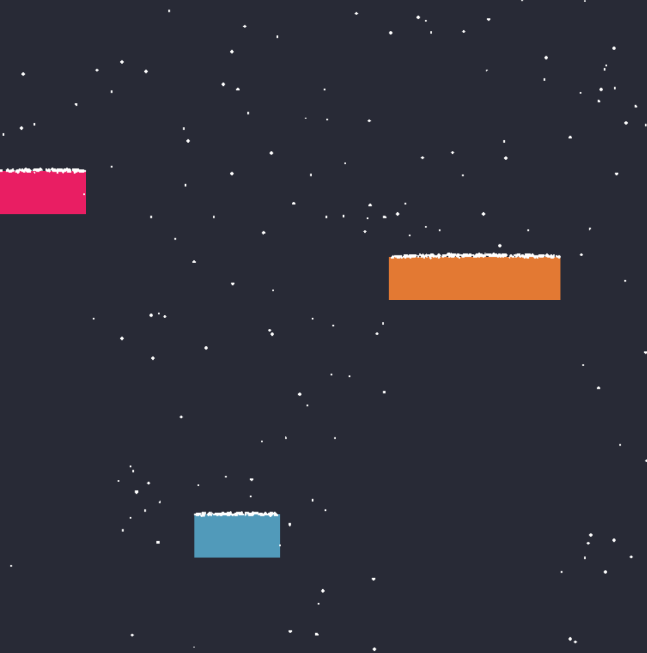
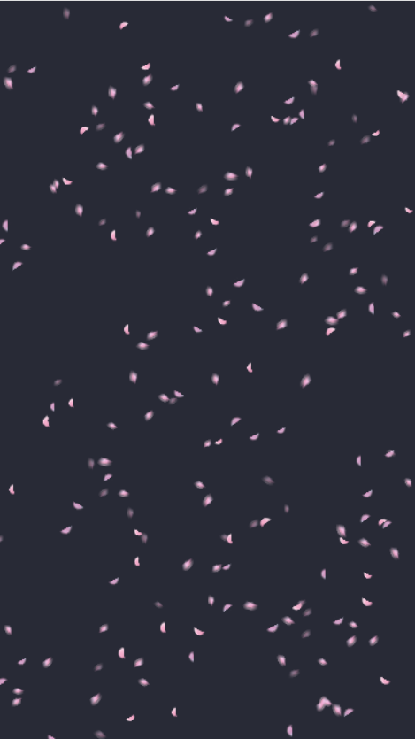
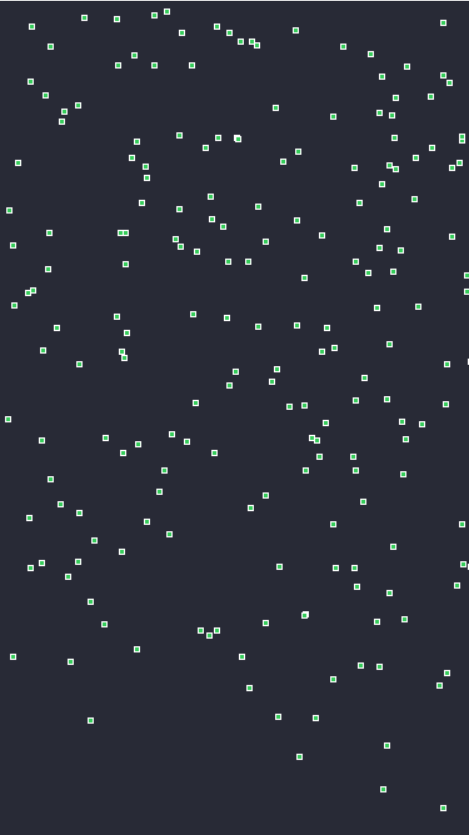

# snow-falls

北风啸啸，雪花飘飘，CPU 在燃烧 😘
_The snow falls and the wind blows cpu is burning_

基于 PIXI.js 的雪花动画

## 目录

- [安装](#安装)
- [示例](#示例)
- [配置参数](#配置参数)

## 安装

npm:

```sh
 npm install snow-falls
```

CDN:

```html
<script src="./../lib/index.js"></script>
```

## 示例

> 克隆这个仓库，运行下面的命令查看效果

```sh
 npm i
 npm run dev
```

<div style="margin-bottom: 5px">
  
</div>

```html
<!DOCTYPE html>
<html lang="zh-CN">
  <head>
    <meta charset="UTF-8" />
    <meta http-equiv="X-UA-Compatible" content="IE=edge" />
    <meta name="viewport" content="width=device-width, initial-scale=1.0" />
    <title>Example</title>
    <style>
      html,
      body,
      .home,
      .background {
        width: 100vw;
        height: 100vh;
        margin: 0;
      }

      .home {
        position: relative;
        background-color: #282a36;
      }

      .background {
        position: absolute;
      }

      .box-1 {
        width: 100px;
        height: 50px;
        background-color: #519aba;
        position: absolute;
        top: 600px;
        left: 30%;
      }

      .box-2 {
        width: 200px;
        height: 50px;
        background-color: #e37933;
        position: absolute;
        top: 300px;
        left: 60%;
      }

      .box-3 {
        width: 100px;
        height: 50px;
        background-color: #e91e63;
        position: absolute;
        top: 200px;
        left: 0;
      }
    </style>
  </head>
  <body>
    <div class="home">
      <div class="box-1 border"></div>
      <div class="box-2 border"></div>
      <div class="box-3 border"></div>
      <div id="background" class="background"></div>
    </div>
    <script src="/index.js"></script>
    <script>
      // CND引入将导出全局变量SnowFalls对象，里面包括两个对象
      // Snow 是最主要的
      // Mod.Wind、Mod.EleBorder为Snow的功能扩展模块
      const { Snow, Mod } = SnowFalls;
      // 实例化Snow类
      new Snow({
        // 要添加动画的容器
        view: document.getElementById("background"),
        // 加载需要的功能模块
        modules: [
          // 载入风力模块，雪花将受风力影响
          new Mod.Wind(),
          // 载入元素积雪效果，使用传入的css类名的元素将产生积雪效果
          // 默认每个元素的积雪数量为当前元素的宽度值，如果当前总积雪数量超过了屏幕里存在的最大的雪花粒子数量，将不在产生下雪效果，请提高snowflakeNum的值解决，过多的边界将产生严重的性能影响
          new Mod.EleBorder("border"),
        ],
        // 屏幕里存在的最大的雪花粒子数量, 默认200。当maxRenderSnow为false时，屏幕中渲染的粒子数量和帧率有关，一般不超过200个
        snowflakeNum: 500,
      });
    </script>
  </body>
</html>
```

## 其它用法

### 将图形替换为图片

```js
new Snow({
  view: document.getElementById("background"),
  // 自动创建的图形替换为图片
  snowflakeTextureSrcs: [
    "./petal_01.png",
    "./petal_02.png",
    "./petal_03.png",
    "./petal_04.png",
    "./petal_05.png",
  ],
  snowflakeSize: [12, 8],
  graphicsRotation: [3, 0],
  modules: [new Mod.Wind()],
});
```

#### 效果

<div style="margin-bottom: 5px">
  
</div>

### 自定义图形创建方法

```ts
new SnowFalls.Snow({
  view: snowCanvas.value,
  rho: 2,
  snowflakeSize: [1, 2],
  // 替换原本的图形创建方法，实现更复杂的图形创建
  graphicsCreateFunction(this: Snowflake) {
    const graphics = new PIXI.Graphics();
    graphics.lineStyle(1, 0xffffff);
    graphics.beginFill(0x35cc5a, 1);
    // 创建矩形
    graphics.drawRect(4, 4, 4, 4);
    graphics.endFill();
    this.addChild(graphics as any);
  },
});
```

#### 效果

<div style="margin-bottom: 5px">
  
</div>

## 配置参数

_具体查看 [index.d.ts](lib/index.d.ts) 文件_

## License

MIT
